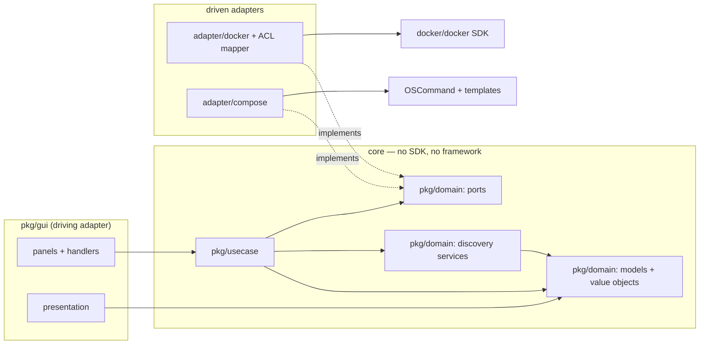
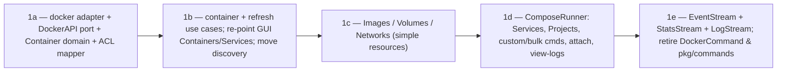

# Phase 1 Design — The Hexagon (ports, domain, use cases)

**Status: DESIGN — for review before any code moves.** This is the target shape for
Phase 1 of `tui-migration-roadmap.md`. No user-visible behavior changes; the app builds
and runs identically at every sub-slice. Golden tests from Phase 0 are the regression guard.

**Goal of Phase 1:** turn `pkg/commands` (domain fused to the Docker SDK) into a clean
hexagon — a framework-free core (domain + ports + use cases) with the Docker SDK and
compose/subprocess execution pushed out into driven adapters. After this phase the GUI
depends only on use-case interfaces and domain types, which is what makes the tview swap
(Phases 3–5) a matter of adding a second driving adapter.

---

## 1. Key finding that shapes the design: two driven ports

The current operations do **not** all go through the Docker SDK. They split cleanly:

| Concern | Backed by | Examples (today) |
|---|---|---|
| **Docker API** | `docker/docker` SDK client | list/inspect, start/stop/restart/pause/remove, prune, logs, stats, events |
| **Compose / subprocess** | `OSCommand` + `CommandTemplates` (shell) | `Service.Up/Stop/Start/Restart`, `Container.Attach`, custom & bulk commands, view-logs-in-pager, `docker compose config` |

So the hexagon has **two outbound ports**, not one. `Service` lifecycle is compose-template
execution; only `Service.Remove` reaches the Docker API (via its container). This split is
already latent in the code — Phase 1 just makes it explicit and enforced.

A third, smaller concern is **streaming** (events, per-container stats, log follow), which
is Docker-API-backed but push-shaped (channels) rather than request/response.

---

## 2. Target package layout

```
pkg/
  domain/                 # the core — no imports of docker/docker, gocui, tcell, tview, color
    container.go          # Container + ContainerDetails
    service.go image.go volume.go network.go project.go
    value.go              # value objects: Status, Health, Port, DerivedStats, TopResult
    port.go               # DRIVEN PORTS (consumer-defined interfaces): DockerAPI, EventStream,
                          #   StatsStream, LogStream, ComposeRunner, Clock
    discovery.go          # PURE domain services: ServicesFromContainers, ProjectNames,
                          #   MergeServices, AssignContainersToServices  (moved out of DockerCommand)
  usecase/                # application services the GUI drives (depend only on ports + domain)
    refresh.go            # reproduces gui.refresh() + RefreshContainersAndServices orchestration
    container.go service.go image.go volume.go network.go project.go
  adapter/
    docker/               # the ONLY place docker/docker is imported
      client.go           # implements DockerAPI/EventStream/StatsStream/LogStream over *client.Client
      mapper.go           # anti-corruption layer: sdk types -> domain types
    compose/              # implements ComposeRunner over OSCommand + CommandTemplates
  app/                    # composition root (existing) — wires adapters -> use cases -> gui
  gui/                    # driving adapter (existing); re-pointed to use cases + domain
    presentation/         # now formats domain types (goldens unchanged; only fixtures change)
```

`pkg/commands` is retired incrementally (see §7) and deleted at the end of Phase 1.



---

## 3. Domain model (drop the embedded SDK types)

Today `Container` embeds `container.Summary` + `container.InspectResponse` and holds a live
client. The clean model is flat data + value objects, with details as a nil-until-loaded
pointer (replacing the `DetailsLoaded()` sentinel):

```go
// pkg/domain/container.go
type Container struct {
    ID              string
    Name            string
    ServiceName     string
    ContainerNumber string
    ProjectName     string
    OneOff          bool
    Image           string
    Status          Status          // value object (was container.State string)
    Ports           []Port          // value objects (was []container.Port)
    Labels          map[string]string // carried for discovery (compose.* labels)
    Details         *ContainerDetails // nil until inspected; replaces DetailsLoaded()
    Stats           *DerivedStats     // latest sample; history lives with the stats stream
}

type ContainerDetails struct {
    Running  bool
    ExitCode int
    Health   Health   // value object: Healthy | Unhealthy | Starting | None
    OpenStdin bool     // used by Attach guard
}
```

```go
// pkg/domain/value.go
type Status int   // Running, Exited, Paused, Created, Restarting, Removing, Dead, Unknown
func (Status) String() string        // "running", "exited", ...  (round-trips SDK strings)
type Health int   // None, Healthy, Unhealthy, Starting
type Port struct{ IP string; Public, Private uint16; Proto string }
type DerivedStats struct{ CPUPercentage, MemoryPercentage float64; /* ...as today */ }
```

- `Service`, `Image`, `Volume`, `Network`, `Project` get the same treatment (flat fields; no
  embedded `image.Summary` / `volume.Volume` / `network.Inspect`). Their models are tiny.
- **Value-object depth is deliberately shallow** (the pragmatic level from the roadmap):
  `Status`/`Health` as typed enums that round-trip the SDK strings, `Port` as a struct. No
  invariant-enforcing aggregates — this is a container dashboard, not a transactional domain.

**Decision to confirm ①:** enum value objects with `String()` round-tripping SDK strings vs.
keeping raw `string` fields. Enums make the Phase-2 semantic-color mapping exhaustive-switch
clean (the linter already enforces `exhaustive`); recommended.

---

## 4. Ports (consumer-defined interfaces in the core)

Ports return **domain types** — the adapter owns the SDK→domain mapping (ACL). Representative
shapes (not the exhaustive final API):

```go
// pkg/domain/port.go
type DockerAPI interface {
    ListContainers(ctx context.Context) ([]Container, error)          // mapped, details nil
    InspectContainer(ctx context.Context, id string) (ContainerDetails, error)
    StartContainer(ctx context.Context, id string) error
    StopContainer(ctx context.Context, id string) error
    RestartContainer(ctx context.Context, id string) error
    PauseContainer(ctx context.Context, id string) error
    UnpauseContainer(ctx context.Context, id string) error
    RemoveContainer(ctx context.Context, id string, opts RemoveOptions) error
    ContainerTop(ctx context.Context, id string) (TopResult, error)
    PruneContainers(ctx context.Context) error

    ListImages(ctx context.Context) ([]Image, error)
    ImageHistory(ctx context.Context, id string) ([]HistoryLayer, error)
    RemoveImage(ctx context.Context, id string, force bool) error
    PruneImages(ctx context.Context) error
    // ...Volumes, Networks: List / Remove / Prune
}

type EventStream interface { // wraps Client.Events  (retires the gui.go:339 direct call)
    Subscribe(ctx context.Context) (<-chan Event, <-chan error)
}
type StatsStream interface { // wraps Client.ContainerStats (CreateClientStatMonitor)
    Follow(ctx context.Context, containerID string) (<-chan DerivedStats, error)
}
type LogStream interface {   // wraps Client.ContainerLogs (retires the container_logs.go:108 direct call)
    Follow(ctx context.Context, containerID string, opts LogOptions) (io.ReadCloser, error)
}

// Compose / subprocess port — returns *exec.Cmd for the driving adapter to run,
// preserving today's model where the GUI owns subprocess/pty handling.
type ComposeRunner interface {
    ServiceCmd(action ServiceAction, svc *Service) (*exec.Cmd, error) // Up/Stop/Start/Restart
    AttachCmd(c *Container) (*exec.Cmd, error)
    ViewLogsCmd(target LogTarget) (*exec.Cmd, error)
    CustomCmd(template string, ctx CommandContext) *exec.Cmd
    Config(project *Project) (string, error) // docker compose config
}

type Clock interface { Now() time.Time } // makes the goEvery tickers & stats elapsed testable
```

**Decision to confirm ②:** the `ComposeRunner` returns `*exec.Cmd` (the GUI still runs it,
matching today's subprocess/suspend behavior) rather than executing internally. Recommended —
it keeps pty/suspend concerns in the driving adapter and avoids leaking `os/exec` semantics
into the core’s control flow.

**Decision to confirm ③:** where ports live. Proposed: `pkg/domain/port.go` (both domain
services and use cases consume them). Alternative: a dedicated `pkg/domain/port` subpackage if
`domain` gets crowded.

---

## 5. Pure domain services (rescued from `DockerCommand`)

The genuinely valuable business logic buried in `docker.go` moves to `pkg/domain/discovery.go`,
now operating on `[]domain.Container` with **zero SDK dependency**:

- `ServicesFromContainers([]Container) []Service` (was `GetServicesFromContainers`, container 
  labels → services)
- `ProjectNames([]Container) []string` (was `GetProjectNames`)
- `MergeServices(labelDerived, composeDeclared []Service) []Service` (was `mergeServices`)
- `AssignContainersToServices([]Container, []Service)` (was `assignContainersToServices`)

These become trivially unit-testable (pure functions over domain slices) — a big coverage win
on logic that is currently only reachable through a live daemon.

---

## 6. Use cases (what the GUI calls instead of `commands.*`)

Use cases orchestrate ports + domain and hand the GUI finished domain objects:

```go
// pkg/usecase/refresh.go — reproduces gui.refresh() + RefreshContainersAndServices
type RefreshUseCase struct { docker domain.DockerAPI; compose domain.ComposeRunner; scoped bool }
func (u *RefreshUseCase) ContainersAndServices(ctx, existing []domain.Container) (
    []domain.Container, []domain.Service, error)  // list -> map -> discovery -> assign
func (u *RefreshUseCase) Images/Volumes/Networks(ctx) (...)

// pkg/usecase/container.go
type ContainerUseCase struct { docker domain.DockerAPI }
func (u *ContainerUseCase) Start/Stop/Restart/Pause/Unpause(ctx, id) error
func (u *ContainerUseCase) Remove(ctx, id, opts) error   // keeps the MustStopContainer mapping
func (u *ContainerUseCase) Attach(...) (*exec.Cmd, error) // via ComposeRunner
```

The GUI keeps its background goroutines and throttled refresh; it just calls use-case methods
and renders the returned domain objects. `presentation.*` functions change their parameter type
from `*commands.Container` to `*domain.Container` — **the golden output is unchanged**, so only
the test *fixtures* change, and the Phase-0 goldens prove we didn't regress rendering.

---

## 7. Migration strategy — strangler, by vertical slice

Build the core alongside `pkg/commands`, then flip the GUI one resource at a time, deleting the
old type as each flips. Suggested sub-slices (each its own `go-developer` delegation + PR, each
green, goldens passing):



- **1a** is the keystone: it proves the ACL mapper against the Phase-0 container goldens.
- **1e** finally converts the two GUI-direct SDK calls (`ContainerLogs`, `Events`) plus stats
  behind ports — which is what completes the deferred `DockerCommand.Client` conversion from
  Phase 0 and lets `docker/docker` leave everything except `adapter/docker`.

**Decision to confirm ④:** strangler-by-resource (recommended — small reviewable PRs, app always
runnable) vs. a temporary `commands` facade that delegates to the core (fewer GUI edits up front
but a throwaway indirection layer). I recommend by-resource.

---

## 8. Enforcement & tests

- **depguard** (add to `.golangci.yml`): `pkg/domain` and `pkg/usecase` may not import
  `github.com/docker/docker/...`, `github.com/jesseduffield/gocui`, `github.com/gdamore/tcell/...`,
  `github.com/fatih/color`, or `github.com/jesseduffield/lazydocker/pkg/gui`. Build fails on breach.
- **Unit tests:** discovery services (pure, table-driven); use cases against fake ports (extend
  the Phase-0 `fakeDockerClient` pattern into a `fakeDockerAPI`).
- **Golden guard:** re-point presentation fixtures to `domain.*`; assert the committed goldens are
  byte-identical. This is the whole point of Phase 0 — it catches any accidental rendering drift.
- **`-race`** on the streaming adapters (events/stats/logs) since they own goroutines.

---

## 9. Decisions (confirmed 2026-07-02)

1. **Value objects** — ✅ typed `Status`/`Health` enums that round-trip SDK strings.
2. **ComposeRunner returns `*exec.Cmd`** — ✅ for the GUI to run (pty/suspend stays in the driving adapter).
3. **Port location** — ✅ `pkg/domain/port.go`.
4. **Rollout** — ✅ strangler-by-resource.
5. **Scope** — ✅ land slice 1a–1b (the container vertical) first as a proof, review in real code,
   then commit to 1c–1e.

Implementation proceeds slice by slice via `go-developer`, each PR green with the Phase-0 goldens passing.
