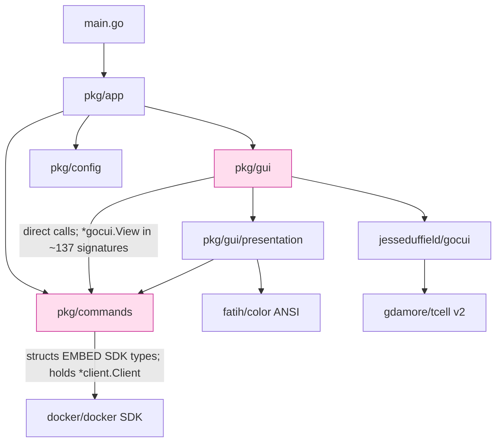
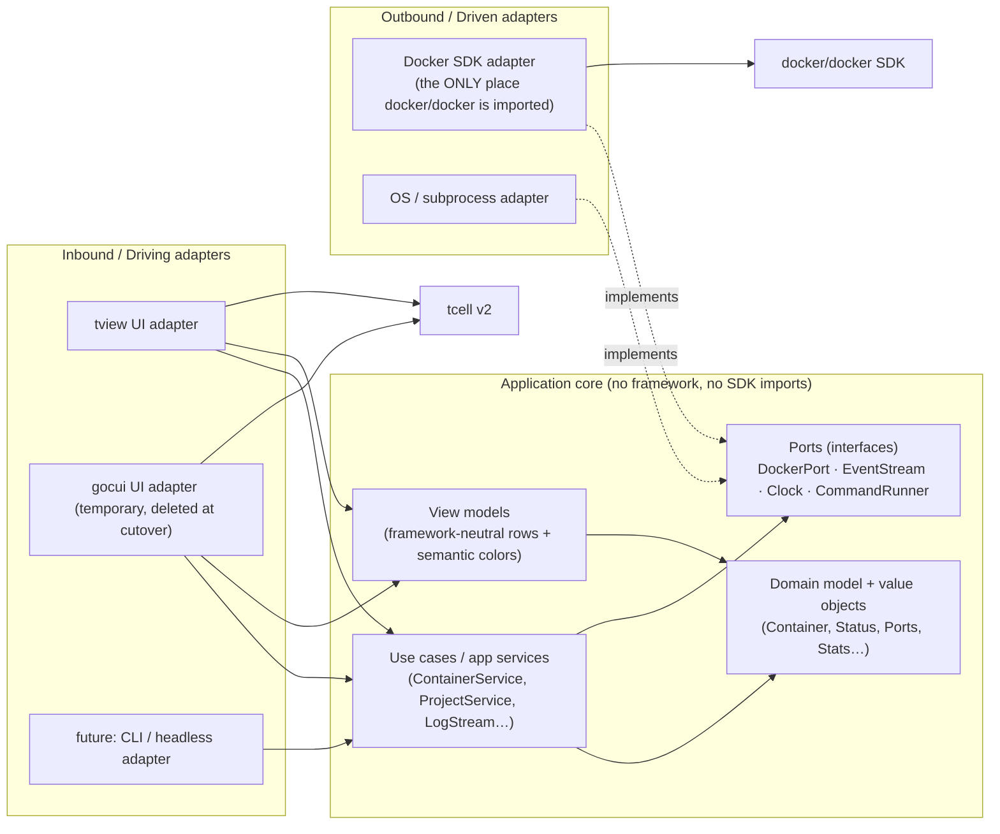
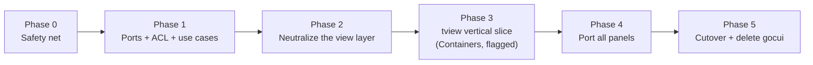

# TUI Migration & Hexagonal Refactor Roadmap

**Goal:** replace the `gocui` TUI with `tview`, and in the process reshape lazydocker
toward a hexagonal (ports-and-adapters) architecture so the UI becomes a *pluggable
adapter* rather than the center of gravity.

**Central thesis:** the two goals are one project. The seam that decouples the domain
from the Docker SDK is the same seam that makes the UI swappable. Build the hexagon
first; then gocui→tview is "add a second driving adapter, validate at parity, delete
the first." We never do a big-bang rewrite — the app stays runnable at every phase
(strangler-fig).

---

## 1. Why tview (recap)

- **Same terminal foundation.** The `jesseduffield/gocui` fork already runs on
  `gdamore/tcell/v2`, which tview also uses and which is already vendored. We swap the
  *widget layer*, not the terminal driver.
- **Same paradigm.** lazydocker is retained-mode and imperative (long-lived views,
  background goroutines mutating shared state under `go-deadlock`, throttled redraws).
  That maps 1:1 onto tview (`app.QueueUpdateDraw`), unlike Bubble Tea's Elm/MVU model
  which would force a full re-architecture.
- **Proven in-domain.** K9s and podman-tui — the closest analogues — are built on tview.
- **Richer widgets** (Table, List, TreeView, Form, Flex/Grid, Pages, Modal), which is the
  actual motivation for leaving gocui.

---

## 2. Current architecture (the starting point)



**The three structural problems** (all of which the migration will fix as a side effect):

1. **No port over Docker.** Domain structs embed `container.Summary` etc. and hold a live
   `*client.Client`; `docker/docker` is imported in 7 files including the GUI and even the
   presentation layer. The domain *is* the SDK.
2. **No dependency inversion GUI↔domain.** `Gui` holds a concrete `*commands.DockerCommand`
   and calls `ctr.Stop()` / `gui.DockerCommand.Refresh…()` directly. Nothing sits between UI
   intent and Docker execution — so the UI can't be swapped or tested in isolation.
3. **Framework leaks past its layer.** `*gocui.View` appears in the panel abstraction's own
   `IGui` interface; ANSI colors from `fatih/color` are baked into presentation output.

---

## 3. Target architecture (hexagon)



**Dependency rule (enforced, not aspirational):** arrows point inward. The core imports
neither `tview`/`gocui` nor `docker/docker`. Adapters depend on the core; the core depends
on nothing but ports and the standard library.

**Enforcement:** the repo already runs `golangci-lint`. Add a `depguard` block so the build
*fails* if the boundary is crossed:

```yaml
# .golangci.yml (illustrative)
linters-settings:
  depguard:
    rules:
      core:
        files: ["**/pkg/core/**", "**/pkg/app/usecases/**", "**/pkg/domain/**"]
        deny:
          - pkg: github.com/docker/docker
            desc: "domain/use-cases must go through DockerPort, not the SDK"
          - pkg: github.com/jesseduffield/gocui
            desc: "core is framework-agnostic"
          - pkg: github.com/gdamore/tcell/v2
            desc: "core is framework-agnostic"
          - pkg: github.com/fatih/color
            desc: "use semantic colors in view models, not ANSI"
```

### Pragmatic hexagon vs. full DDD purity — a decision point

lazydocker is a ~12.5k-LOC tool, not an enterprise domain. Two levels are on the table;
**the roadmap targets the pragmatic level** and notes where the purist option would go
further, so you can dial it per phase:

| Concern | Pragmatic (recommended) | Full DDD purity (optional) |
|---|---|---|
| Docker coupling | Port + anti-corruption mapper; domain structs are plain data | Rich aggregates, invariants enforced in domain |
| Domain behavior | Thin entities + use-case services | Domain services, domain events, value objects everywhere |
| Value objects | A few where they pay off (`Status`, `Health`, `Port`) | Exhaustive VOs, no primitives-in-domain |
| Payoff | Testability + UI swap + one SDK-facing seam | Textbook DDD; likely over-engineered here |

The pragmatic level already delivers the two things you actually want: **a testable core**
and **a swappable UI**. Escalate to purity only for parts that prove volatile.

---

## 4. Phased roadmap

Each phase leaves `master` green and the app runnable. Phases 0–2 are the hexagonal
refactor (no user-visible change); Phases 3–5 are the tview swap that the refactor unlocks.



### Phase 0 — Safety net & baseline (prerequisite)

You cannot refactor a TUI safely at ~11% coverage with an untested GUI. Build the net first.

- **Characterization ("golden") tests for presentation.** Feed fixed domain fixtures into
  `GetContainerDisplayStrings`, `GetServiceDisplayStrings`, stats/graph formatters, and snapshot
  the exact output rows. These become the behavioral spec both UIs must satisfy.
- **Fake Docker client.** Introduce a narrow interface in front of `*client.Client` (even a wide
  one to start) so `pkg/commands` logic runs in tests without a daemon. This is also the first
  dependency-inversion wedge for Phase 1.
- **Extract the color leak.** Move the color logic out of `pkg/commands/image.go` into
  presentation (small, do it now while adding its golden test).
- **Exit criteria:** presentation + command logic exercised in CI without a real Docker daemon;
  coverage baseline recorded; all golden snapshots committed.
- **Risk:** low. **Parallelizable:** yes (per resource type).

### Phase 1 — Define the hexagon: ports, anti-corruption layer, use cases

No UI change. gocui stays, but is re-pointed to call use cases instead of Docker directly.

- **`pkg/domain`** — plain domain models (`Container`, `Service`, `Image`, `Volume`, `Network`,
  `Project`) that **do not embed SDK types**, plus a few value objects (`Status`, `Health`,
  `Port`, `Stats`). Start data-only; add behavior only where it earns it.
- **Anti-corruption layer** — mappers `sdk → domain` (e.g. `container.Summary` → `domain.Container`).
  This is where every `docker/docker` type is translated and quarantined.
- **Outbound port** — `DockerPort` (interface) covering everything the app needs: list/inspect,
  lifecycle (start/stop/restart/pause/remove), prune, logs, stats stream, event stream. Also
  `CommandRunner` (subprocess) and `Clock` (for the `goEvery` tickers → testable time).
- **Outbound adapter** — `pkg/adapters/docker` implements `DockerPort` using the SDK. **All
  `docker/docker` imports move here.**
- **Use cases** — `pkg/app/usecases` (`ContainerService`, `ProjectService`, `ImageService`, …)
  depending only on ports + domain. These absorb the orchestration currently living in the GUI
  (refresh sequencing, "start then refresh", custom/bulk command execution).
- **Re-point gocui** to call use cases; gocui becomes a *driving adapter* (still importing gocui,
  but no longer importing Docker).
- **Exit criteria:** `docker/docker` imported **only** in `pkg/adapters/docker`; `depguard` rule
  added and passing; use cases unit-tested against a fake `DockerPort`.
- **Risk:** medium (touches every command path). **Sequencing:** do it per resource type behind
  the stable use-case interface, one vertical at a time.

### Phase 2 — Neutralize the view layer (remove gocui from the "middle")

Still no framework swap — but by the end, presentation + panel logic contain zero gocui types.
This is the seam that makes Phase 3 possible.

- **View models.** Presentation stops returning ANSI strings and returns framework-neutral view
  models: rows of cells + a **semantic color** (`ColorRunning`, `ColorExited`, `ColorWarn`…), not
  `color.FgGreen`. Add two tiny color adapters: ANSI (for gocui today) and tview-tag (for Phase 3).
- **De-gocui the panel abstraction.** Remove `*gocui.View` from `ISideListPanel`/`IGui`. Replace
  with a neutral `ListView` / `TextPane` handle interface. `FilteredList[T]` and `ListPanel[T]` are
  already gocui-free; this pulls `SideListPanel[T]` down to the same level.
- **Define the UI-facing contract** the driving adapter must satisfy (render list, render main
  pane, set tabs, focus, prompt/confirm/error, filter input). gocui implements it via a thin adapter.
- **Exit criteria:** `presentation/`, `panels/`, and use cases have **zero** `gocui`/`tcell` imports;
  `depguard` extended to forbid them there; golden tests still pass (behavior unchanged).
- **Risk:** medium. This is the highest-leverage phase — it's where "swappable UI" actually happens.

### Phase 3 — tview vertical slice (Containers panel, behind a flag)

First real tview code. Prove the contract end-to-end on one panel before committing to all.

- Build `pkg/adapters/tview` implementing the Phase-2 UI contract for **just the Containers panel**:
  side list (`tview.Table`) + main pane (`tview.TextView`) + a handful of keybindings + selection.
- Reuse `arrangement.go` weights to configure `tview.Flex`/`Grid`; map the keybinding table to
  `SetInputCapture`; route background refresh through `app.QueueUpdateDraw`.
- Add a launch flag / env toggle (`LAZYDOCKER_UI=tview`) selecting the driving adapter in `pkg/app`.
- **Exit criteria:** Containers panel at behavioral parity under tview (validated against Phase-0
  golden output); both UIs build and run.
- **Risk:** medium — this is where unknowns surface (color-tag translation via `tview.TranslateANSI`,
  focus model, mouse). Cheap to iterate because it's one panel.

### Phase 4 — Port the remaining panels to tview

Mechanical repetition of Phase 3, one panel per PR.

- Services, Images, Volumes, Networks, Projects, Menu; then confirmation/prompt/error modals
  (`tview.Modal`/`Pages`), log streaming (`TextView` + `SetChangedFunc`), stats (tview widgets or
  keep asciigraph strings), manual filtering, custom + bulk commands, screen modes, mouse, i18n.
- Port all ~86 keybindings; keep the declarative table, change only the registration mechanism.
- **Exit criteria:** tview reaches full feature parity with gocui across every panel; parity checked
  against golden tests + a manual QA checklist.
- **Risk:** low-medium per panel, but broad. **Parallelizable:** yes — independent panels.

### Phase 5 — Cutover & delete gocui

- Flip the default to tview; soak for a release; then delete the gocui driving adapter, drop the
  `jesseduffield/gocui` dependency from `go.mod`/`vendor` (tcell stays — tview needs it), and remove
  now-dead glue (and `boxlayout` if tview's layout fully replaces it).
- **Exit criteria:** gocui absent from the module graph; tview is the sole UI; `depguard` rules
  simplified to the steady-state hexagon.
- **Risk:** low (removal only), once parity is proven.

---

## 5. Where the existing code lands

| Today | Phase | Becomes |
|---|---|---|
| `pkg/commands/*` (SDK-embedded structs) | 1 | split → `pkg/domain` (models) + `pkg/adapters/docker` (SDK) + `pkg/app/usecases` |
| `pkg/gui/presentation/*` (ANSI rows) | 2 | view models + semantic colors (core-side); color adapters per framework |
| `pkg/gui/panels/*` (`FilteredList`, `ListPanel`) | 2 | move core-side, gocui removed from `SideListPanel`'s interface |
| `pkg/gui/arrangement.go` (boxlayout weights) | 3 | feeds `tview.Flex`/`Grid` config |
| `pkg/gui/keybindings.go` (86-entry table) | 3–4 | same table → `SetInputCapture` registration |
| `pkg/gui/*_panel.go` (gocui handlers) | 3–4 | thin tview adapter calling use cases |
| `pkg/gui/gui.go` (Run loop, `g.Update`, focus) | 3–5 | `tview.Application` + `QueueUpdateDraw` |
| `pkg/tasks` (async render tasks) | — | reused as-is (already framework-agnostic) |
| `pkg/config`, `pkg/i18n` | — | unchanged |

---

## 6. Risk register

| Risk | Likelihood | Mitigation |
|---|---|---|
| Refactoring the GUI with no test net causes silent regressions | High → controlled | Phase 0 golden tests are a hard prerequisite; nothing else starts first |
| Color fidelity differs (ANSI → tview tags) | Medium | Semantic colors in Phase 2; `tview.TranslateANSI` bridge; golden tests assert output |
| Background-refresh races under tview's draw model | Medium | tview's `QueueUpdateDraw` is the sanctioned thread-safe path; keep `go-deadlock` during migration |
| Hexagon boundary erodes over time | Medium | `depguard` fails the build on violation — not a code-review convention |
| Scope creep into full DDD purity | Medium | Explicit pragmatic-vs-purity table; escalate only volatile parts |
| tview is pre-1.0 (v0.x) API churn | Low | Isolated behind the driving adapter; core is unaffected by tview API changes |
| Effort underestimated | Medium | Vertical-slice Phase 3 de-risks before the broad Phase 4 commitment |

---

## 7. Recommended sequencing

1. **Phase 0 is non-negotiable and comes first** — it's the safety net *and* the behavioral spec
   the tview UI will be validated against.
2. **Phases 1–2 deliver value even if the tview swap were cancelled**: a testable, SDK-decoupled
   core with a framework-neutral view layer is strictly better architecture on its own.
3. **Phase 3 is the go/no-go gate.** One panel end-to-end reveals the real cost; commit to Phase 4
   only after it's proven.
4. Phases 0, 4 are internally parallelizable by resource type; 1–3 are best done as focused verticals.
